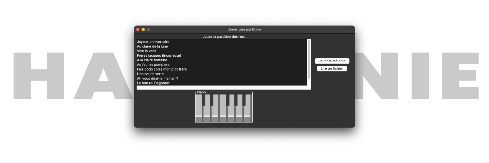

# L'Harmonie est Numérique

Project for our first Python course at Efrei Paris, made in December 2020/January 2021.



## About

L'harmonie est numérique (harmony is digital) is a program that lets you play pieces of music with a cool display of the notes that are played.

The program also lets you generate new pieces of music using the Markov chain algorithm and manipulate existing tracks.

## Features

This programs lets you generate new pieces of music usign the Markov chain algorithm. To do this, select one or multiple tracks you'd like the new track to be inspired by, and click Generate.

You can also combine tracks, transpose (shift all notes up or down) and invert them (e.g. high notes become low notes...).

## How to install

Clone the repository on your computer with

```shell
git clone https://github.com/hugopanel/harmonie.git
```

Move to the project's folder and install the required libraries:

```shell
pip install -r requirements.txt
```

Start the project:

```shell
python main.py
```

---

Copyright &copy; 2020-2021, Hugo PANEL, Mohamed ZAMMIT CHATTI.
